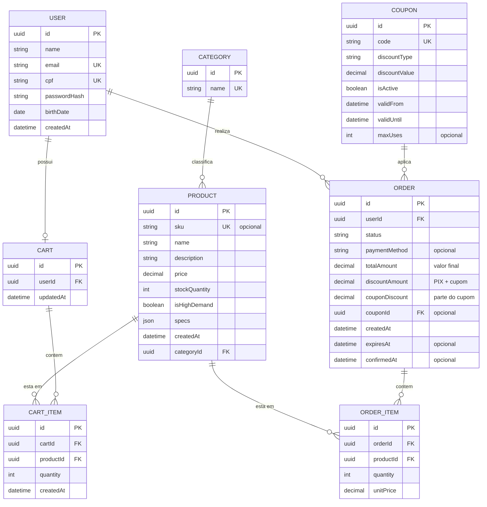

# Diagrama ER - AdapTech

```mermaid
erDiagram
    USER ||--o| CART : possui
    USER ||--o{ ORDER : realiza
    CATEGORY ||--o{ PRODUCT : classifica
    PRODUCT ||--o{ CART_ITEM : "esta em"
    PRODUCT ||--o{ ORDER_ITEM : "esta em"
    CART ||--o{ CART_ITEM : contem
    ORDER ||--o{ ORDER_ITEM : contem
    COUPON ||--o{ ORDER : aplica

    USER {
        uuid id PK
        string name
        string email UK
        string cpf UK
        string passwordHash
        date birthDate
        datetime createdAt
    }

    CATEGORY {
        uuid id PK
        string name UK
    }

    PRODUCT {
        uuid id PK
        string sku UK "opcional"
        string name
        string description
        decimal price
        int stockQuantity
        boolean isHighDemand
        json specs
        datetime createdAt
        uuid categoryId FK
    }

    CART {
        uuid id PK
        uuid userId FK
        datetime updatedAt
    }

    CART_ITEM {
        uuid id PK
        uuid cartId FK
        uuid productId FK
        int quantity
        datetime createdAt
    }

    ORDER {
        uuid id PK
        uuid userId FK
        string status
        string paymentMethod "opcional"
        decimal totalAmount "valor final"
        decimal discountAmount "PIX + cupom"
        decimal couponDiscount "parte do cupom"
        uuid couponId FK "opcional"
        datetime createdAt
        datetime expiresAt "opcional"
        datetime confirmedAt "opcional"
    }

    ORDER_ITEM {
        uuid id PK
        uuid orderId FK
        uuid productId FK
        int quantity
        decimal unitPrice
    }

    COUPON {
        uuid id PK
        string code UK
        string discountType
        decimal discountValue
        boolean isActive
        datetime validFrom
        datetime validUntil
        int maxUses "opcional"
    }
```